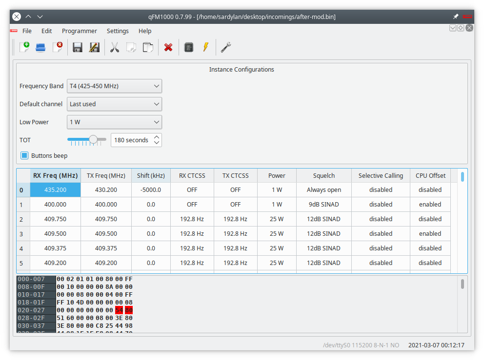

# qFM1000

> Simple tool for editing channels and configuration parameters of Philips FM1000 radio.

qFM1000 is a simple tool for editing channels and configuration parameters
saved into the 24C16 EEPROMs mounted inside of any Philips FM-1000 like
radio devices.

qFM1000 is written using C++, is based on the Qt/C++ cross-platform framework
and can be built using cmake in Linux, Windows, or MacOS with gcc, CLang or
Visual Studio compilers.

## Releases

All releases are created using CPack extension of CMake builder.

Since I'm still working on a complete refactoring, there are no pre-compiled
installers of the new version. You can still find old ones on the
[Releases](https://github.com/sardylan/qfm1000/releases) section.

## Changelog

* 0.7.0
    * ADD: "New File" feature
* 0.6.1
    * ADD: Support for model A9, TM and U0
* 0.6.0
    * ADD: Support for UHF frequencies
    * FIX: Bug on Intel HEX parsing
* 0.5.0
    * ADD: Support for reading files in I8HEX (Intel HEX with 16 bit addresses) format
* 0.4.2
    * FIX: Arduino serial port in Windows
* 0.4.1
    * FIX: Fix build for old Qt version
    * FIX: Arduino serial port in Windows
* 0.4.0
    * ADD: Support for read/write EEPROM with Arduino
* 0.3.1
    * FIX: Power values and channel numbers
* 0.3.0
    * ADD: Support for squelch values
    * TOOL: Add Coverity Scan support
* 0.2.1
    * FIX: Bitwise error on eeprom flags
* 0.2.0
    * ADD: Simple error messages for invalid files
    * ADD: Tests for EEPROM methods
    * ADD: Travis builds
    * ADD: AppVeyor builds
    * FIX: EEPROM flags bitwise
* 0.1.3
    * ADD: "Save as" feature
* 0.1.0
    * CHANGE: New interface
    * ADD: TOT feature
* 0.0.0
    * Initial commit (import from qCw)

## Contributing

1. [Fork it](<https://github.com/sardylan/qfm1000/fork>).
2. Create your feature branch (`git checkout -b feature_foo`)
3. Commit your changes (`git commit -am "Add some foo"`)
4. Push to the branch in your repository (`git push origin feature_foo`)
5. Create a new Pull Request

## Development environment

The whole project is developed under GNU/Linux Ubuntu 20.04 using JetBrains CLion IDE,
and uses CMake as build tool, but can be developed using any IDE, included simple
file editors like [VIm](https://en.wikipedia.org/wiki/Vim_(text_editor))
or [Notepad](https://en.wikipedia.org/wiki/Microsoft_Notepad).

Please have a look to [BUILD.md](BUILD.md) for installing required tools and libraries.

## Meta

Luca Cireddu - IS0GVH - sardylan@gmail.com

I wish to thanks all the people without whom this software cannot be made:

- All friends and colleagues in our local [E.R.A.](http://www.eracagliari.eu) club, here in Cagliari,
- All the people in Transmission1 forum, especially "recat" user,
- David Craig (GI8LCJ) for all the very useful informations published in his his RadCom article,
- all the people who wrote me e-mails about this software, and who let me know that there is still 
  interest on these devices,
- everyone who test this software and report me with very useful suggestions.

## License

This program is free software: you can redistribute it and/or modify it under the terms of the GNU General Public
License as published by the Free Software Foundation, either version 3 of the License.

See [LICENSE.md](LICENSE.md) for more information.
